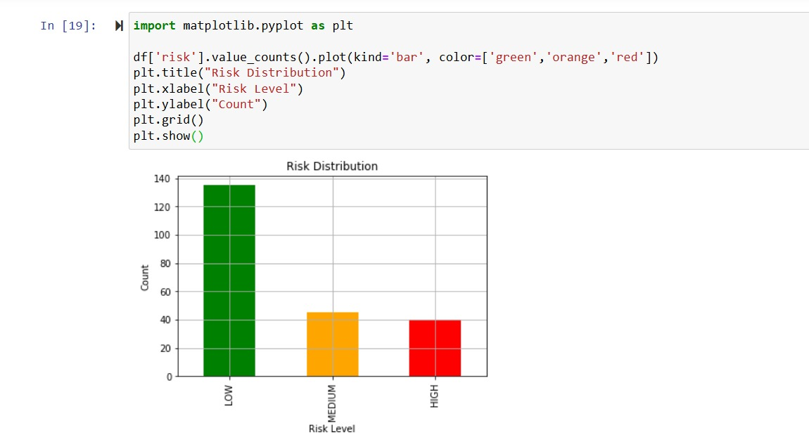
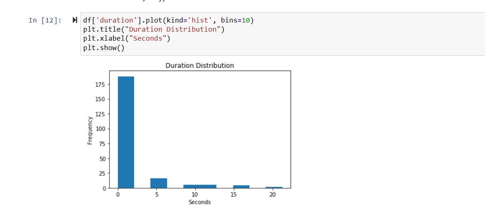

# Data-Driven Smart Theft Protection and Intrusion Risk Analysis System

##  Overview

This project is a real-time smart security system designed to monitor activity near entry points like doors. Instead of just recording video like traditional CCTV, this system actively detects human presence, evaluates how risky the situation is, and sends alerts when needed.

Along with detection, the system also stores data about each event and performs analysis to understand behavior patterns.

---

## Problem Statement

Most existing surveillance systems only capture footage but do not provide intelligent insights or real-time alerts. This makes it difficult to identify suspicious activity quickly or take action.

The goal of this project is to build a system that:

* Detects people in real-time
* Identifies suspicious behavior
* Sends instant alerts
* Uses collected data to understand patterns

---

## Solution

The system uses a camera feed and a YOLO-based object detection model to identify people. Once a person is detected, the system measures:

* How close they are (based on bounding box size)
* How long they stay in the frame

Based on these factors, the system classifies the situation into:

* 🟢 LOW Risk → Short or distant presence
* 🟡 MEDIUM Risk → Moderate duration or distance
* 🔴 HIGH Risk → Very close or staying for long

For high-risk situations, the system triggers:

* An alarm sound
* A Telegram notification

---

##  Features

* Real-time human detection using YOLOv8
* Risk classification (LOW, MEDIUM, HIGH)
* Continuous alarm system for high-risk events
* Instant Telegram alerts
* Automatic data logging (CSV format)
* Data analysis using Python (Pandas, Matplotlib)
* Visualization of patterns and behavior

---

##  Tech Stack

* Python
* OpenCV
* YOLO (Ultralytics)
* Pandas
* Matplotlib
* Jupyter Notebook

---

##  Data Analysis

The system does not stop at detection — it also collects data and analyzes it.

Using the collected data, I was able to:

* Identify peak hours when activity is highest
* Analyze how long people stay in monitored areas
* Understand how risk levels are distributed
* Observe behavior patterns over time

---

##  Key Insights

* High-risk events usually happen when a person stays longer or comes very close
* Low-risk events are short and often not threatening
* The system is able to clearly separate normal and suspicious activity

---

##  Results

### 🔍 Detection System


### 📊 Data Analysis






---

---

## 🚀 How to Run

### 1. Clone the repository

```
git clone <your_repo_link>
cd Data-Driven-Smart-Theft-Protection-and-Intrusion-Risk-Analysis-System
```

### 2. Create virtual environment

```
python -m venv venv
.\venv\Scripts\Activate
```

### 3. Install dependencies

```
pip install -r requirements.txt
```

### 4. Run the system

```
python tracking.py
```

---

## 🔐 Note

For security reasons, the Telegram bot token is not included in this repository. You will need to create your own bot using BotFather and update the token in the code.

---

## 📌 Future Improvements

* Deploy the system on a Raspberry Pi for real-world use
* Develop a mobile app for alerts
* Add predictive analytics for risk forecasting
* Integrate with cloud-based monitoring systems

---

## 👨‍💻 Author

Seela Venkata Naga Suraj
B.Tech Data Science Student
